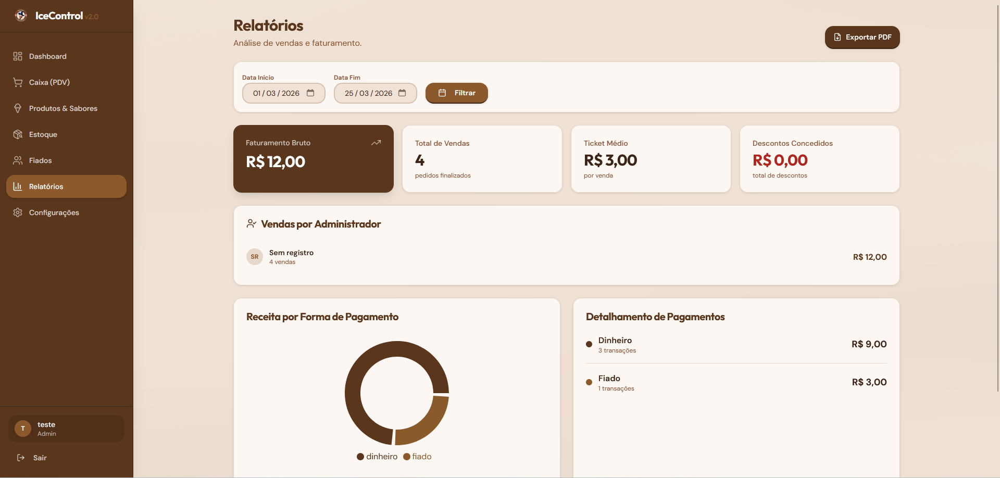

# IceControl (Mestre Sorveteiro) 🍦

O **IceControl** é um sistema moderno e completo de gestão, desenvolvido especialmente para atender às necessidades de sorveterias. A solução integra funcionalidades essenciais como controle de vendas (PDV), gestão detalhada de estoque, administração de clientes — incluindo contas de fiado — e geração de relatórios estratégicos para apoio na tomada de decisões.

O projeto foi idealizado e desenvolvido sob medida para a sorveteria local [Mestre Sorveteiro](https://www.instagram.com/mestresorveteiro.sm/).

##  Tecnologias

O projeto utiliza o ecossistema JavaScript/TypeScript, organizado em uma arquitetura de monorepo:


##  Funcionalidades

###  Frente de Caixa (PDV)
- **Venda de Produtos Simples:** Bebidas, picolés, itens de conveniência com baixa automática de estoque.
- **Montagem de Sorvetes:** Fluxo inteligente para escolha de tipo (casquinha, cascão, copos de diversos tamanhos, milk-shakes), sabores (com limites por tipo), coberturas e adicionais.
- **Carrinho Dinâmico:** Gerenciamento de itens antes da finalização.
- **Pagamentos Flexíveis:** Suporte a Dinheiro, PIX, Cartão e Fiado, com cálculo automático de troco.

###  Controle de Estoque
- **Gestão de Produtos:** Controle por unidade e alerta de estoque baixo.
- **Gestão de Sabores:** Controle específico por "bolas" de sorvete com alertas visuais no dashboard.
- **Movimentações:** Histórico de entradas e saídas com registro de motivos.

###  Gestão de Fiados
- **Cadastro de Clientes:** Base de dados de clientes vinculada ao sistema de vendas.
- **Controle de Débitos:** Visualização de saldos em aberto e detalhamento de itens consumidos.
- **Pagamentos Parciais:** Registro de abatimentos de dívidas com atualização em tempo real.

###  Dashboard e Relatórios
- **Visão Geral:** Indicadores de vendas diárias, semanais e mensais.
- **Relatórios:** Vendas por período, formas de pagamento e acompanhamento de metas.
- **Alertas:** Notificações de itens críticos em estoque.

##  Instalação e Configuração

Consulte o arquivo [**INSTALACAO.md**](./INSTALACAO.md) para o guia passo a passo detalhado.

### Comandos Rápidos

1. **Instalar dependências:**
   ```powershell
   pnpm install
   ```

2. **Configurar o Banco de Dados:**
   Certifique-se de configurar o arquivo `.env` e execute:
   ```powershell
   pnpm db:push
   ```

3. **Iniciar em modo de desenvolvimento:**
   - **API:** `pnpm --filter @workspace/api-server dev`
   - **Interface Web:** `pnpm --filter @workspace/icecontrol dev`

##  Manutenção e Utilitários

O projeto conta com scripts de manutenção para facilitar operações críticas via terminal:

- **Zerar Quantidades de Estoque:**
  ```powershell
  pnpm --filter @workspace/scripts maintenance:reset-estoque
  ```
- **Resetar Usuários (Exclusão Total):**
  ```powershell
  pnpm --filter @workspace/scripts maintenance:reset-usuarios
  ```
- **Rodar Testes de Venda (E2E):**
  ```powershell
  pnpm --filter @workspace/scripts test-sales
  ```

---
